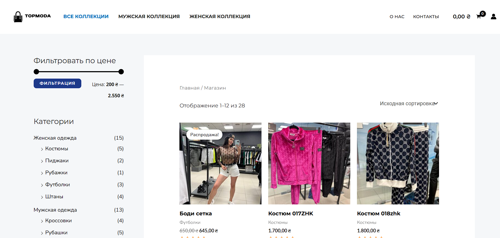
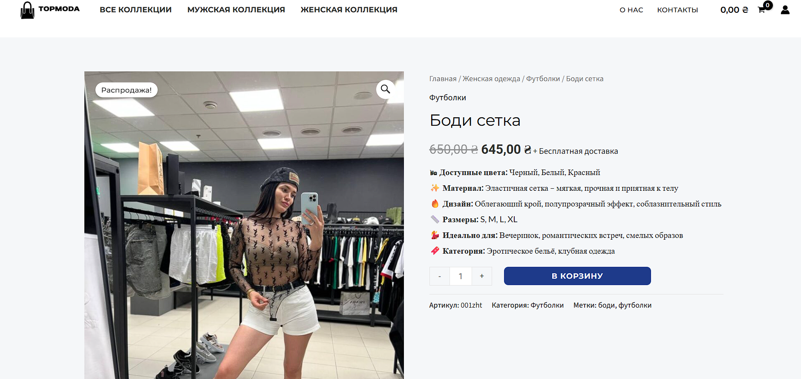
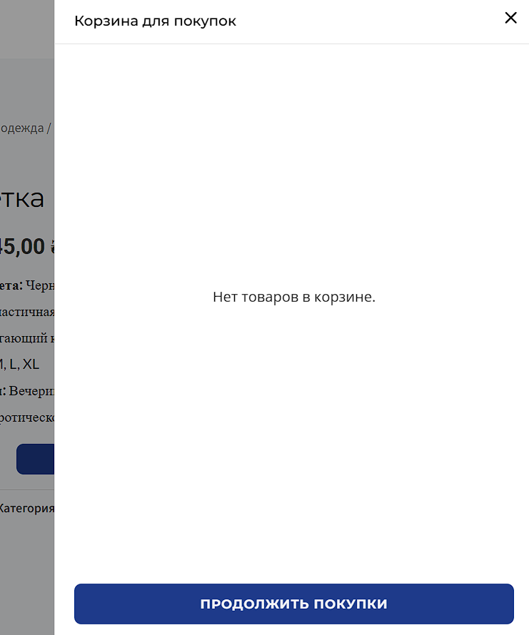

# 👗 TopModa — Інтернет-магазин модного одягу

**TopModa** — це сучасний онлайн-магазин для продажу модного одягу. Побудований на WordPress з використанням плагіна WooCommerce, сайт забезпечує просту навігацію, адаптивний дизайн і зручну покупку з будь-якого пристрою.

---

## 📌 Основні функції

- 🛒 Повноцінна система електронної комерції (WooCommerce)
- 📋 Каталог товарів з фільтрами
- 📷 Галереї товарів
- 💳 Онлайн-оплата
- 📦 Управління замовленнями
- 🧾 Податкові й логістичні налаштування
- 🔍 Пошук і сортування
- 📱 Адаптивний дизайн (мобільна версія)
- 🛠️ SEO-оптимізація

---

## ⚙️ Технології

| Система                    | Використання                |
| -------------------------- | --------------------------- |
| **WordPress**              | CMS для керування контентом |
| **WooCommerce**            | Плагін для продажів         |
| **PHP**                    | Мови розробки               |
| **MySQL**                  | База даних                  |
| **Elementor** *(optional)* | Візуальний редактор         |

---

## 🚀 Як запустити локально

### 1. Встановлення через OpenServer

> Вимагає встановлений [OpenServer](https://ospanel.io/)

1. Склонуйте репозиторій або скопіюйте файли у:
   C:\OpenServer\domains\topmoda.local\

2. Створіть базу даних `topmoda` через phpMyAdmin.

3. Імпортуйте `.sql` файл бази (якщо є).

4. Перейдіть до [http://topmoda.local](http://topmoda.local) у браузері.

5. Завершіть встановлення WordPress:

- Сервер: `localhost`
- Користувач: `root`
- Пароль: *(порожній)*
- База: `topmoda`

6. Увійдіть в адмін-панель та активуйте тему + плагіни.

---

## 🗀️ Скріншоти

| Головна | Каталог | Товар | Кошик |
| :-----: | :-----: | :---: | :---: |
|  |  |  |  |

---

## 📁 Структура проєкту

topmoda/wp-content/themes/plugins/uploads/wp-config.php/index.php/README.md

---

## 📚 Корисні посилання

- [WooCommerce Documentation](https://woocommerce.com/documentation/)
- [WordPress.org](https://wordpress.org/)
- [OpenServer (рос)](https://ospanel.io/)

